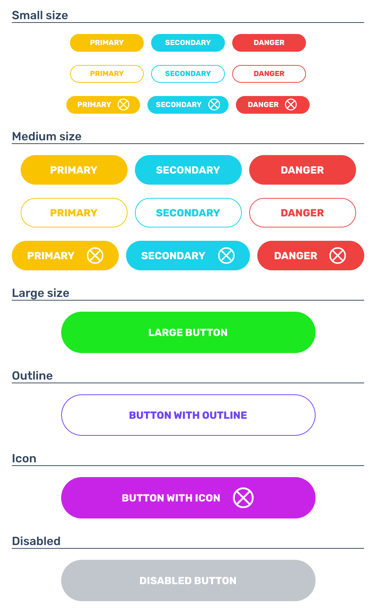

<h1 align="center">Ulys-Btn</h1>

> *Ulys-Btn for Angular 7 and Ionic 4*


# Overview

>**An Angular component allowing to create customizable buttons. It can be styled with several attributtes like the label, the size, the color, the filling and the icon in order to have the desired buttons types.**

* [Install](#install)
* [Usage](#usage)
* [Properties](#properties)
* [Captures](#captures)

## <a id="install"></a>Install

No install needed! Just add the folder ```ulys-btn/``` into your project folder.

## <a id="usage"></a>Usage

Add ```UlysBtnComponent``` to your module's ```declarations```

```typescript
import { NgModule } from '@angular/core';
import { BrowserModule } from '@angular/platform-browser';
import { AppComponent } from './app.component';

import { UlysBtnComponent } from 'path-of-{ulys-btn.component}';

@NgModule({
  imports: [BrowserModule, UlysBtnComponent],
  declarations: [AppComponent],
  bootstrap: [AppComponent]
})

class AppModule {}
```

And then use it in your component (or in your page if you use Ionic)

```typescript
import { Component } from '@angular/core';

@Component({
    selector: 'app-example',
    template: `
        <ulys-btn
          [label]="'My button'" 
          [size]="'medium'" 
          [color]="'primary'" 
          [fill]="'outline'" 
          [iconUrl]="'path-of-your-icon>'">
        </ulys-btn>
  `
})
export class AppComponent {

  constructor() { }

}
```

## <a id="properties"></a>Properties

* [[label]](#label)
* [[size]](#size)
* [[color]](#color)
* [[fill]](#fill)
* [[iconUrl]](#icon-url)
* [[disabled]](#disabled)

### <a id="label"></a>[label]

| Property | Type | Category | Required |
| -------- | ---- | -------- | -------- |
| `[label]` | `string` | Input | No |


The text to dsiplay on the button.


### <a id="size"></a>[size]

| Property | Type | Category | Required |
| -------- | ---- | -------- | -------- |
| `[size]` | `string` | Input | No |


This attribute specifies the size of the button. Setting this attribute will change the height and padding of a button. It takes three different values: `large`, `medium` and `small`. If no size is specified, the button is set by default to `medium`


### <a id="color"></a>[color]

| Property | Type | Category | Required |
| -------- | ---- | -------- | -------- |
| `[color]` | `string` | Input | No |


This attributes specifies the color of the button. If the the `[fill]` attriubte is set to `solid`, the color pof the text on the button stays `white` and if it is set to `outline`, the background is transparent and the text takes the specified color. This attribute can three predefined color value: `primary`, `secondary` and `danger`. Otherwise, it can also be specified in defferents ways like CSS color values:
  * _By color names_
  * _As RGB values_
  * _As heaxadecimal values_
  * _As HSL values (CSS3)_

If no color value is specified, the color is set by default to `primary`


### <a id="fill"></a>[fill]

| Property | Type | Category | Required |
| -------- | ---- | -------- | -------- |
| `[fill]` | `string` | Input | No |


This attributes specifies the filling of the buttons. It takes two values: 
  * `solid` (the default behavior): sets the background to the specified color
  * `outline`: sets the background color to white and adds a border with the same color around the button


### <a id="icon-url"></a>[iconUrl]

| Property | Type | Category | Required |
| -------- | ---- | -------- | -------- |
| `[iconUrl]` | `string` | Input | No |


Contains a URL or a URL fragment that points to the icon file. If empty string is specified or the the icon file can not be found, a predefined icon is


### <a id="disabled"></a>[disabled]

| Property | Type | Category | Required |
| -------- | ---- | -------- | -------- |
| `[disabled]` | -- | Input | No |


If specified, the button is disabled, can not be clicked.


## <a id="captures"></a>Captures

An example of several buttons with different options


